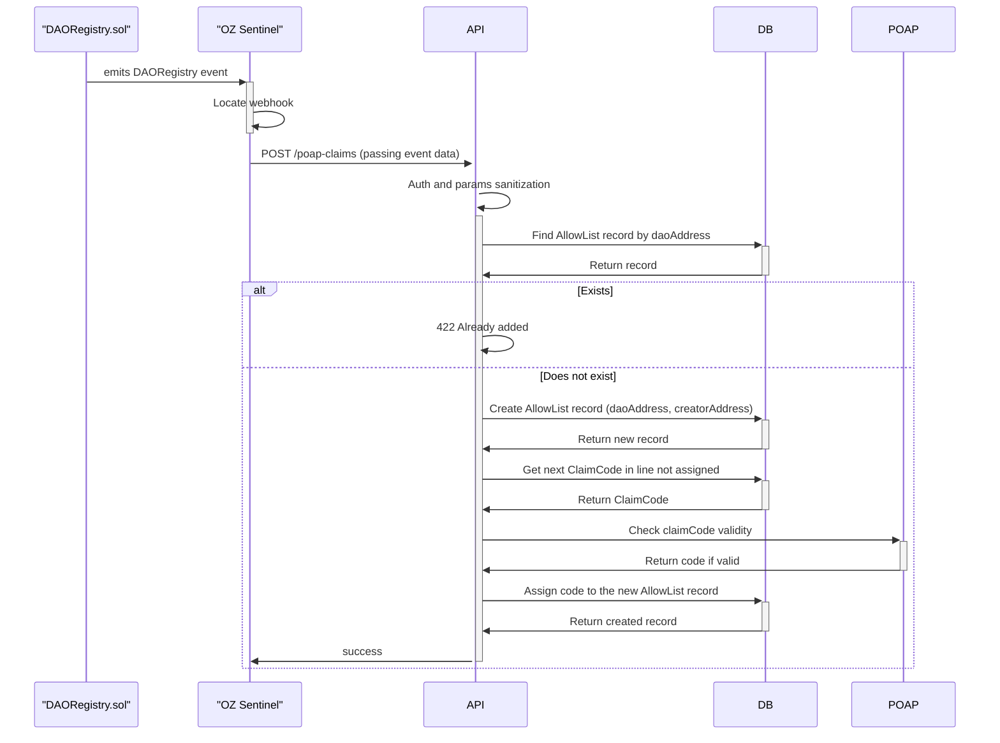
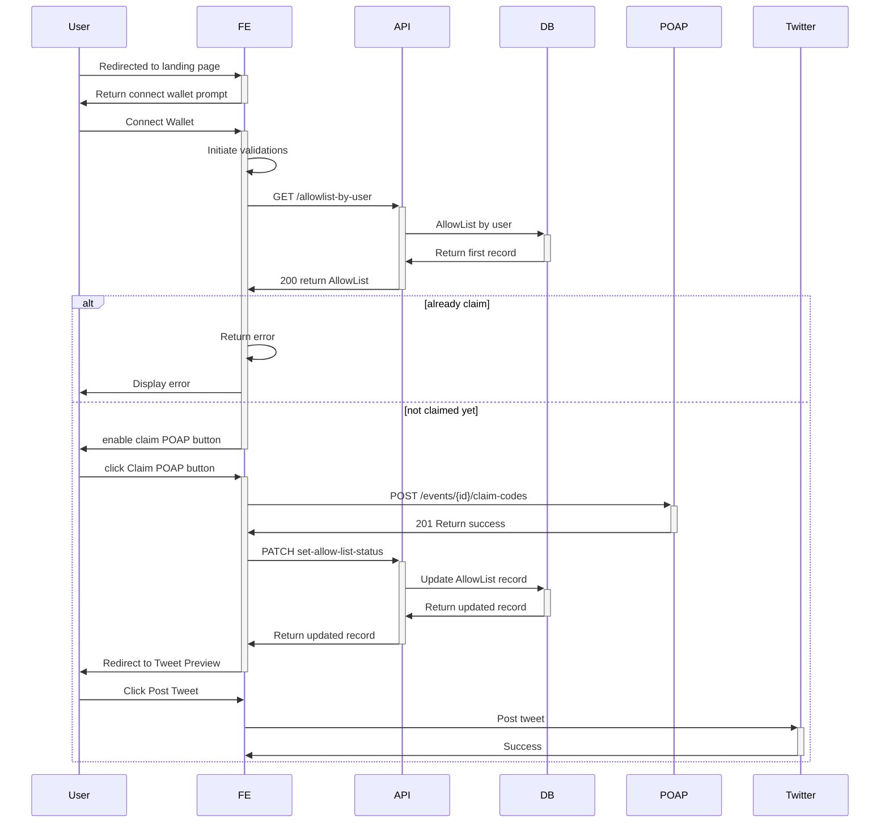
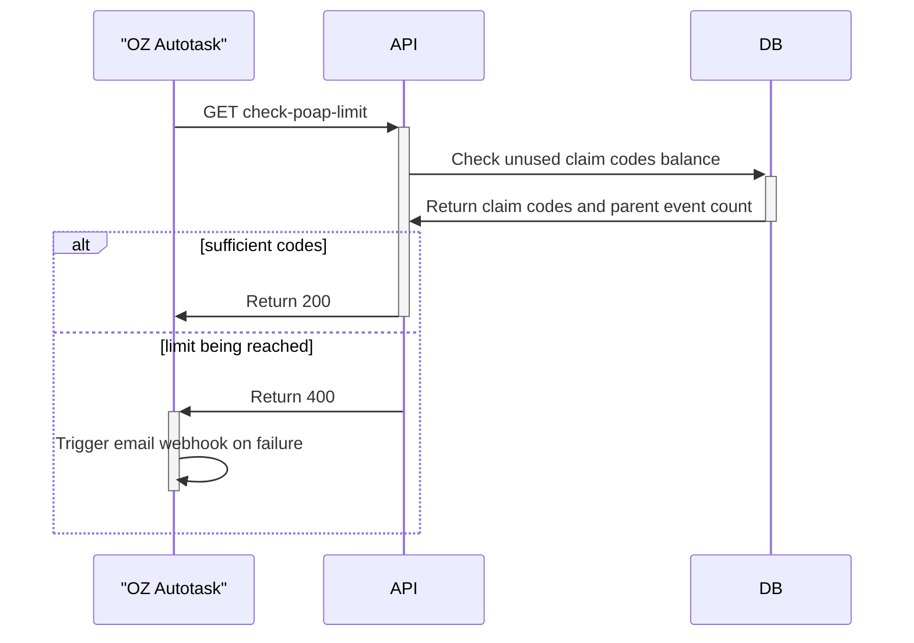
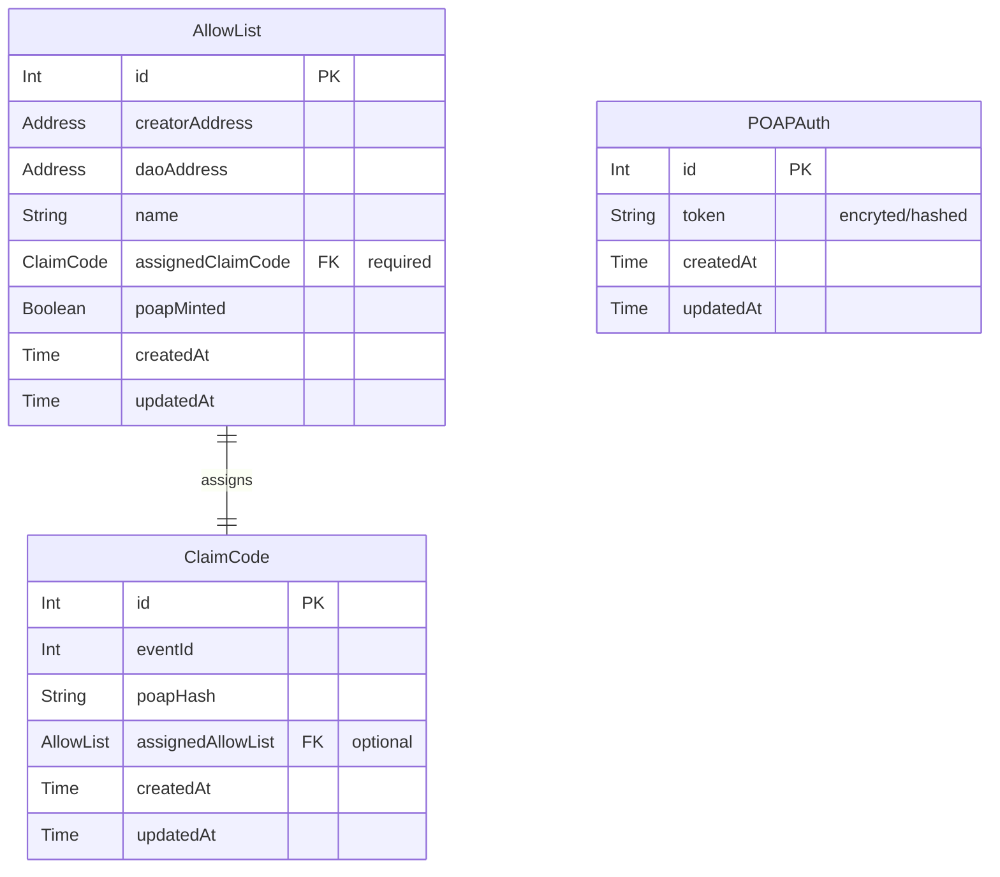

## Community Launch Settlement Flow

```mermaid
    sequenceDiagram
        participant DAO as "DAORegistry.sol"
        participant OZ as "OZ Sentinel"
        DAO ->>+ OZ: emits DAORegistry event
        OZ ->>- OZ: Locate webhook
        OZ ->>+ API: POST /poap-claims (passing event data)
        API ->>+ API: Auth and params sanitization
        API ->>+ DB: Find AllowList record by daoAddress
        DB ->>- API: Return record
        alt Exists
        API ->> API: 422 Already added
        else Does not exist
        API ->>+ DB: Create AllowList record (daoAddress, creatorAddress)
        DB ->>- API: Return new record
        API ->>+ DB: Get next ClaimCode in line not assigned
        DB ->>- API: Return ClaimCode
        API ->>+ POAP: Check claimCode validity
        POAP ->>- API: Return code if valid
        API ->>+ DB: Assign code to the new AllowList record
        DB ->>- API: Return created record
        API ->>- OZ: success
        end
```

## POAP Claim Flow

```mermaid
    sequenceDiagram
        User ->>+ FE: Redirected to landing page
        FE ->>- User: Return connect wallet prompt
        User ->>+ FE: Connect Wallet
        FE ->> FE: Initiate validations
        FE ->>+ API: GET /allowlist-by-user
        API ->>+ DB: AllowList by user
        DB ->>- API: Return first record
        API ->>- FE: 200 return AllowList
        alt already claim
        FE ->> FE: Return error
        FE ->> User: Display error
        else not claimed yet
        FE ->>- User: enable claim POAP button
        User ->>+ FE: click Claim POAP button
        FE ->>+ POAP: POST /events/{id}/claim-codes
        POAP ->>- FE: 201 Return success
        FE ->>+ API: PATCH set-allow-list-status
        API ->>+ DB: Update AllowList record
        DB ->>- API: Return updated record
        API ->>- FE: Return updated record
        FE ->>- User: Redirect to Tweet Preview
        User ->> FE: Click Post Tweet
        FE ->>+ Twitter: Post tweet
        Twitter ->>- FE: Success
        end
```

## Event Codes Limit Notification

```mermaid
sequenceDiagram
    participant OZ as "OZ Autotask"
    OZ ->>+ API: GET check-poap-limit
    API ->>+ DB: Check unused claim codes balance
    DB ->>- API: Return claim codes and parent event count
    alt sufficient codes
    API ->>- OZ: Return 200
    else limit being reached
    API ->>+ OZ: Return 400
    OZ ->>- OZ: Trigger email webhook on failure
    end
```

## Data model

```mermaid
erDiagram
    AllowList {
        Int id PK
        Address creatorAddress
        Address daoAddress
        String name
        ClaimCode assignedClaimCode FK "required"
        Boolean poapMinted
        Time createdAt
        Time updatedAt
    }

    ClaimCode {
        Int id PK
        Int eventId
        String poapHash
        AllowList assignedAllowList FK "optional"
        Time createdAt
        Time updatedAt
    }

    POAPAuth {
        Int id PK
        String token "encryted/hashed"
        Time createdAt
        Time updatedAt
    }

    AllowList ||--|| ClaimCode: assigns
```
